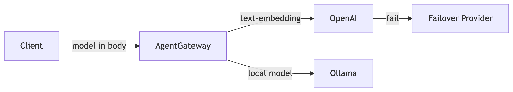
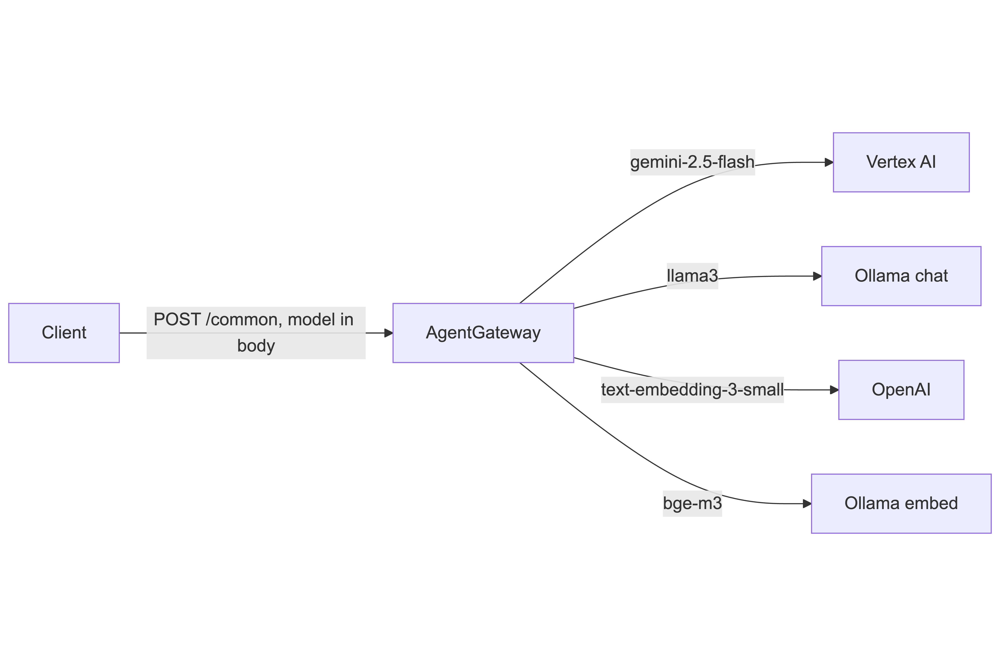

# 01 — LLM Body-Based Routing

Route incoming requests to different LLM backends based on the **`model` field in the JSON request body**. An `EnterpriseAgentgatewayPolicy` extracts the model name into a request header at the PreRouting phase; standard Gateway API `HTTPRoute` rules then match on that header to dispatch to the correct backend.

> This setup targets **Enterprise Agentgateway on Kubernetes** using the Gateway API (`gateway.networking.k8s.io`).

## Architecture



```
Client Request
    │  body: { "model": "..." }
    ▼
EnterpriseAgentgatewayPolicy (PreRouting)
    │  sets X-Gateway-Model-Name  = json(body).model
    │  sets X-Gateway-Model-Status = "specified" | "unspecified"
    ▼
HTTPRoute (header match)
    ├─ X-Gateway-Model-Name matches model A → BackendA
    ├─ X-Gateway-Model-Name matches model B → BackendB
    └─ X-Gateway-Model-Status = "unspecified"  → providers-fallback (group)
```

## Concepts

| Concept | Description |
|---------|-------------|
| `EnterpriseAgentgatewayPolicy` | Enterprise CRD that runs a traffic transformation at `PreRouting` phase to promote body fields into headers |
| `X-Gateway-Model-Name` | Header populated from `json(request.body).model`; used as the routing key |
| `X-Gateway-Model-Status` | Set to `specified` or `unspecified`; enables a catch-all fallback route |
| `AgentgatewayBackend` | CRD wrapping an AI provider (Vertex AI, OpenAI, Ollama, etc.) with optional auth and route policies |
| `ai.groups` | Pool of providers inside a backend; used for the fallback/load-balance backend |
| `Passthrough` route type | Forward the request as-is without LLM-specific policy enforcement |

---

## Scenario A — Chat Completions: Vertex AI vs Local Ollama

**Config:** `config/bbr.yaml`

Routes `/chat` requests to **Vertex AI (Gemini 2.5 Flash)** or a **local Ollama (Llama 3)** instance based on the `model` field. Requests with no `model` field fall back to a group backend that tries both providers.

### Resources

| Resource | Kind | Purpose |
|----------|------|---------|
| `agentgateway` | `Gateway` | Single entry point on port `8080` |
| `vertex-ai-secret` | `Secret` | Google credentials for Vertex AI |
| `vertex-ai` | `AgentgatewayBackend` | Vertex AI — Gemini 2.5 Flash, project `customer-success-386314`, region `us-central1` |
| `local-ollama` | `AgentgatewayBackend` | Local Ollama at `host.minikube.internal:11434`, model `llama3` |
| `body-routing-policy` | `EnterpriseAgentgatewayPolicy` | Promotes `model` from request body to `X-Gateway-Model-Name` / `X-Gateway-Model-Status` headers |
| `providers-fallback` | `AgentgatewayBackend` | Group: Vertex AI (Gemini 2.5 Flash) → Ollama (Llama 3) |
| `providers-single-route` | `HTTPRoute` | Header-match rules for `/chat` dispatching |

### Routing Rules

| Path | Header Match | Backend |
|------|-------------|---------|
| `/chat` | `X-Gateway-Model-Name` matches `google/gemini-.*` (regex) | `vertex-ai` |
| `/chat` | `X-Gateway-Model-Name: llama3` | `local-ollama` |
| `/chat` | `X-Gateway-Model-Status: unspecified` | `providers-fallback` |

### Apply

```bash
kubectl apply -f config/bbr.yaml
```

### Test — route to Vertex AI (Gemini)

```bash
curl http://<GATEWAY_IP>:8080/chat \
  -H "Content-Type: application/json" \
  -d '{
    "model": "google/gemini-2.5-flash",
    "messages": [{"role": "user", "content": "Who are you?"}]
  }'
```

### Test — route to local Ollama

```bash
curl http://<GATEWAY_IP>:8080/chat \
  -H "Content-Type: application/json" \
  -d '{
    "model": "llama3",
    "messages": [{"role": "user", "content": "Who are you?"}]
  }'
```

### Test — fallback (no model specified)

```bash
curl http://<GATEWAY_IP>:8080/chat \
  -H "Content-Type: application/json" \
  -d '{
    "messages": [{"role": "user", "content": "Who are you?"}]
  }'
```

---

## Scenario B — Embeddings: OpenAI vs Local Ollama

**Config:** `config/bbr-embeddings.yaml`

Routes `/embeddings` requests to **OpenAI** or a **local Ollama** embedding model based on the `model` field. All backends use `Passthrough` routing since embeddings do not require LLM-specific policy enforcement. A URL rewrite strips the `/embeddings` prefix before forwarding to the backend.

### Resources

| Resource | Kind | Purpose |
|----------|------|---------|
| `agentgateway` | `Gateway` | Single entry point on port `8080` (shared with Scenario A) |
| `openai-secret` | `Secret` | OpenAI API key |
| `openai` | `AgentgatewayBackend` | OpenAI — model `text-embedding-3-small`; all routes `Passthrough` |
| `local-ollama` | `AgentgatewayBackend` | Local Ollama at `host.minikube.internal:11434`, model `bge-m3`, path `/api/embed`; all routes `Passthrough` |
| `body-routing-policy` | `EnterpriseAgentgatewayPolicy` | Same policy as Scenario A — promotes `model` to headers |
| `providers-fallback` | `AgentgatewayBackend` | Group: OpenAI (`text-embedding-3-large`) → Ollama (`all-minilm`) |
| `providers-single-route` | `HTTPRoute` | Header-match rules for `/embeddings` dispatching with URL rewrite |

### Routing Rules

| Path | Header Match | Backend | URL Rewrite |
|------|-------------|---------|------------|
| `/embeddings` | `X-Gateway-Model-Name: text-embedding-3-small` | `openai` | Strip prefix → `/` |
| `/embeddings` | `X-Gateway-Model-Name: bge-m3` | `local-ollama` | Strip prefix → `/` |
| `/embeddings` | `X-Gateway-Model-Status: unspecified` | `providers-fallback` | — |

### Apply

```bash
kubectl apply -f config/bbr-embeddings.yaml
```

### Test — route to OpenAI

```bash
curl http://<GATEWAY_IP>:8080/embeddings \
  -H "Content-Type: application/json" \
  -d '{
    "model": "text-embedding-3-small",
    "input": "The quick brown fox"
  }'
```

### Test — route to local Ollama

```bash
curl http://<GATEWAY_IP>:8080/embeddings \
  -H "Content-Type: application/json" \
  -d '{
    "model": "bge-m3",
    "input": "The quick brown fox"
  }'
```

### Test — fallback (no model specified)

```bash
curl http://<GATEWAY_IP>:8080/embeddings \
  -H "Content-Type: application/json" \
  -d '{
    "input": "The quick brown fox"
  }'
```

---

## Scenario C — Unified Endpoint: Chat + Embeddings on a Single Route

**Config:** `config/bbr-single-endpoint.yaml`

Consolidates chat and embedding routing onto a **single `/common` path**. All four backends (Vertex AI, Ollama chat, OpenAI embeddings, Ollama embeddings) are reachable through one HTTPRoute, and a single `providers-fallback-common` group covers all of them for unspecified-model requests.



### Resources

| Resource | Kind | Purpose |
|----------|------|---------|
| `agentgateway` | `Gateway` | Single entry point on port `8080` |
| `vertex-ai-secret` | `Secret` | Google credentials for Vertex AI |
| `openai-secret` | `Secret` | OpenAI API key |
| `vertex-ai` | `AgentgatewayBackend` | Vertex AI — Gemini 2.5 Flash, project `customer-success-386314`, region `us-central1` |
| `local-ollama-chat` | `AgentgatewayBackend` | Ollama at `192.168.162.8:11434`, model `llama3`, path `/v1/chat/completions` (OpenAI-compatible) |
| `openai-embeddings` | `AgentgatewayBackend` | OpenAI — model `text-embedding-3-small`; all routes `Passthrough` |
| `local-ollama-embeddings` | `AgentgatewayBackend` | Ollama at `192.168.162.8:11434`, model `bge-m3`, path `/api/embed`; all routes `Passthrough` |
| `providers-fallback-common` | `AgentgatewayBackend` | Group: Vertex AI → Ollama chat → OpenAI embeddings → Ollama embeddings |
| `providers-common-route` | `HTTPRoute` | Header-match rules for `/common` dispatching to all backends |
| `providers-agentgateway` | `EnterpriseAgentgatewayPolicy` | Promotes `model` from request body to `X-Gateway-Model-Name` / `X-Gateway-Model-Status` headers; targets the gateway directly |

### Routing Rules

| Path | Header Match | Backend | URL Rewrite |
|------|-------------|---------|------------|
| `/common` | `X-Gateway-Model-Name: google/gemini-2.5-flash` | `vertex-ai` | — |
| `/common` | `X-Gateway-Model-Name: llama3` | `local-ollama-chat` | — |
| `/common` | `X-Gateway-Model-Name: text-embedding-3-small` | `openai-embeddings` | Rewrite to `/v1/embeddings` |
| `/common` | `X-Gateway-Model-Name: bge-m3` | `local-ollama-embeddings` | — |
| `/common` | `X-Gateway-Model-Status: unspecified` | `providers-fallback-common` | — |

### Fallback Group Priority

`providers-fallback-common` tries providers in this order:

1. Vertex AI (`google/gemini-2.5-flash`)
2. Ollama chat (`llama3`)
3. OpenAI embeddings (`text-embedding-3-large`)
4. Ollama embeddings (`all-minilm`)

### Apply

```bash
kubectl apply -f config/bbr-single-endpoint.yaml
```

### Test — route to Vertex AI (chat)

```bash
curl http://<GATEWAY_IP>:8080/common \
  -H "Content-Type: application/json" \
  -d '{
    "model": "google/gemini-2.5-flash",
    "messages": [{"role": "user", "content": "Who are you?"}]
  }'
```

### Test — route to local Ollama (chat)

```bash
curl http://<GATEWAY_IP>:8080/common \
  -H "Content-Type: application/json" \
  -d '{
    "model": "llama3",
    "messages": [{"role": "user", "content": "Who are you?"}]
  }'
```

### Test — route to OpenAI (embeddings)

```bash
curl http://<GATEWAY_IP>:8080/common \
  -H "Content-Type: application/json" \
  -d '{
    "model": "text-embedding-3-small",
    "input": "The quick brown fox"
  }'
```

### Test — route to local Ollama (embeddings)

```bash
curl http://<GATEWAY_IP>:8080/common \
  -H "Content-Type: application/json" \
  -d '{
    "model": "bge-m3",
    "input": "The quick brown fox"
  }'
```

### Test — fallback (no model specified)

```bash
curl http://<GATEWAY_IP>:8080/common \
  -H "Content-Type: application/json" \
  -d '{
    "messages": [{"role": "user", "content": "Who are you?"}]
  }'
```

---

## Key Takeaways

- `EnterpriseAgentgatewayPolicy` with `phase: PreRouting` is the mechanism for body-based routing — it lifts the `model` field out of the JSON body into a header so standard Gateway API header matching can do the dispatching.
- `X-Gateway-Model-Status: unspecified` provides a zero-config fallback: requests that omit the `model` field are automatically caught and sent to a group backend.
- Embedding backends use `Passthrough` for all routes and a `URLRewrite` filter to remove the path prefix before forwarding to the provider.
- `ai.groups` in the fallback backend enables provider-level redundancy (priority ordering) with no extra infrastructure.

## Prerequisites

- Kubernetes cluster with Enterprise Agentgateway installed (`enterprise-agentgateway` GatewayClass)
- Secrets populated before applying:
  - `vertex-ai-secret`: set `Authorization` to your Google Application credentials (`bbr.yaml`)
  - `openai-secret`: set `Authorization` to your OpenAI API key (`bbr-embeddings.yaml`)
- For Ollama routes: Ollama running locally and accessible from the cluster
  - Scenarios A/B use `host.minikube.internal:11434`
  - Scenario C uses a direct IP (`192.168.162.8:11434`) — update the YAML to match your environment

## Reference

- [Enterprise Agentgateway docs](https://agentgateway.dev/docs/)
- [EnterpriseAgentgatewayPolicy](https://agentgateway.dev/docs/enterprise/policies/)
- [Gateway API HTTPRoute](https://gateway-api.sigs.k8s.io/api-types/httproute/)
- [Vertex AI provider](https://agentgateway.dev/docs/standalone/main/integrations/llm-providers/vertex-ai/)
- [OpenAI provider](https://agentgateway.dev/docs/standalone/main/integrations/llm-providers/openai/)
