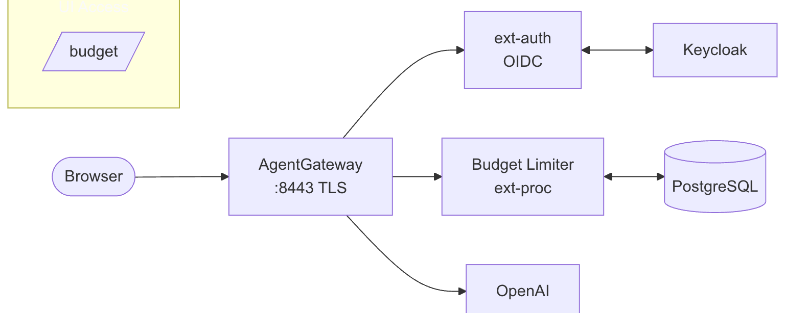

# Cost Control with Budget Management

This demo showcases Agent Gateway's cost control capabilities using a budget management service that enforces spending limits on LLM requests.

## Overview


## Architecture



## Components

| Component | Description |
|-----------|-------------|
| **Agent Gateway** | Routes LLM requests and applies ext-proc for cost enforcement |
| **Budget Management** | ext-proc service that calculates costs and enforces budgets |
| **PostgreSQL** | Stores budget definitions, usage records, and model pricing |
| **Keycloak** | OIDC provider for UI authentication |
| **Budget UI** | Web interface for managing budgets and viewing usage |

## Features Demonstrated

- **Real-time cost tracking** - Token usage converted to USD costs
- **Budget enforcement** - Requests blocked when budget is exhausted
- **Hierarchical budgets** - Org-level and team-level budget limits
- **Warning thresholds** - Alerts before budget exhaustion (default: 80%)
- **OIDC-protected UI** - Secure access to budget management console

## Configuration Files

| File | Purpose |
|------|---------|
| `config.yaml` | Gateway, HTTPRoutes, OIDC auth, and policies |
| `budget-management-deploy.yaml` | Budget management service deployment |
| `postgresql-deploy.yaml` | PostgreSQL with schema initialization |

## Budget Service Environment Variables

The budget management service is configured via the following environment variables:

### Server Configuration

| Variable | Default | Description |
|----------|---------|-------------|
| `GRPC_PORT` | `4444` | gRPC port for ext-proc communication with Agent Gateway |
| `HTTP_PORT` | `8080` | HTTP port for REST API and UI |
| `METRICS_PORT` | `9090` | Prometheus metrics endpoint |
| `DATABASE_URL` | - | PostgreSQL connection string |
| `LOG_LEVEL` | `info` | Logging level (`debug`, `info`, `warn`, `error`) |
| `LOG_FORMAT` | `json` | Log format (`json` or `text`) |

### Caching Configuration

| Variable | Default | Description |
|----------|---------|-------------|
| `MODEL_COST_CACHE_TTL` | `60s` | How long to cache model pricing data |
| `BUDGET_CACHE_TTL` | `10s` | How long to cache budget definitions |
| `RESERVATION_TTL` | `5m` | How long to hold cost reservations for in-flight requests |

### Cost Estimation

| Variable | Default | Description |
|----------|---------|-------------|
| `DEFAULT_ESTIMATION_MULTIPLIER` | `1.0` | Multiplier for estimated costs (use >1.0 for safety margin) |
| `DEFAULT_ESTIMATED_INPUT_TOKENS` | `100` | Default input tokens when estimation is needed |
| `DEFAULT_ESTIMATED_OUTPUT_TOKENS` | `100` | Default output tokens when estimation is needed |

### Authentication (Optional)

| Variable | Default | Description |
|----------|---------|-------------|
| `AUTH_ENABLED` | `false` | Enable JWT validation for API requests |

## Prometheus Metrics

The budget management service exposes metrics on port `9090` at `/metrics`. These can be scraped by Prometheus for monitoring and alerting.

### Request Metrics

| Metric | Type | Labels | Description |
|--------|------|--------|-------------|
| `budget_management_requests_total` | Counter | `result` | Total requests processed (`allowed` or `denied`) |
| `budget_management_checks_total` | Counter | `entity_type`, `name`, `result` | Budget checks per entity |
| `budget_management_check_duration_seconds` | Histogram | `entity_type` | Duration of budget check operations |

### Cost & Token Metrics

| Metric | Type | Labels | Description |
|--------|------|--------|-------------|
| `budget_management_cost_charged_usd_total` | Counter | `entity_type`, `name`, `model` | Total cost charged in USD |
| `budget_management_tokens_total` | Counter | `entity_type`, `name`, `model`, `direction` | Tokens processed (`input` or `output`) |

### Budget State Metrics

| Metric | Type | Labels | Description |
|--------|------|--------|-------------|
| `budget_management_usage_usd` | Gauge | `entity_type`, `name`, `period` | Current budget usage in USD |
| `budget_management_remaining_usd` | Gauge | `entity_type`, `name`, `period` | Remaining budget in USD |
| `budget_management_utilization_pct` | Gauge | `entity_type`, `name`, `period` | Budget utilization percentage |

### Rate Limiting & Fallback Metrics

| Metric | Type | Labels | Description |
|--------|------|--------|-------------|
| `budget_management_requests_rate_limited_total` | Counter | `entity_type`, `name` | Requests denied due to budget exhaustion |
| `budget_management_fallbacks_total` | Counter | `child_*`, `parent_*` | Requests that fell back to parent budget |

### Reservation Metrics

| Metric | Type | Labels | Description |
|--------|------|--------|-------------|
| `budget_management_active_reservations` | Gauge | - | Number of active cost reservations |
| `budget_management_reservations_created_total` | Counter | - | Total reservations created |
| `budget_management_reservations_expired_total` | Counter | - | Total reservations expired |

### ext-proc Metrics

| Metric | Type | Labels | Description |
|--------|------|--------|-------------|
| `budget_management_extproc_requests_total` | Counter | `phase`, `status` | ext-proc requests processed |
| `budget_management_extproc_duration_seconds` | Histogram | `phase` | ext-proc processing duration |
| `budget_management_periods_reset_total` | Counter | `period` | Budget periods reset |

### Accessing Metrics

```bash
# Port-forward the metrics port
kubectl port-forward -n agentgateway-system svc/budget-management 9090:9090

# Fetch metrics
curl http://localhost:9090/metrics
```

## Prerequisites

- Agent Gateway installed with enterprise features
- Keycloak running with `agw-dev` realm configured. Refer to [extras/keycloak/README.md](../extras/keycloak/README.md) for more details.
- `budget-management` client registered in Keycloak

## Deployment

The images have been published to the following repository. 

```bash
australia-southeast1-docker.pkg.dev/field-engineering-apac/public-repo/budget-management-ui@sha256:7a3935ee848b06e84d3c67cd54a280c08ac55a8adaec18e7d7d1e45a12c534be
```

and

```bash
australia-southeast1-docker.pkg.dev/field-engineering-apac/public-repo/budget-management-extproc@sha256:6f67b783d69577005d3f06d83e7a1233488fbbf1bfcb0bc1ea4ec547d9d07c84
```

```bash
# 1. Set OpenAI API key in config.yaml
# Replace: <set OPENAI_API_KEY> with your actual key

# 2. Apply PostgreSQL
kubectl apply -f config/postgresql-deploy.yaml

# 3. Apply budget management service
kubectl apply -f config/budget-management-deploy.yaml

# 4. Apply gateway configuration
kubectl apply -f config/config.yaml
```

## Accessing the UI

```bash
# Port-forward the gateway (HTTPS)
kubectl port-forward -n agentgateway-system svc/agentgateway 8443:443

# Add to /etc/hosts
echo "127.0.0.1 budget-management.agentgateway-system.svc.cluster.local" | sudo tee -a /etc/hosts

# Access UI
open https://budget-management.agentgateway-system.svc.cluster.local:8443
```

### Demo video


## Testing Budget Enforcement

```bash
# Port-forward the gateway (HTTP)
kubectl port-forward -n agentgateway-system svc/agentgateway 8080:8080

# Make LLM request
curl -X POST http://localhost:8080/openai/v1/chat/completions \
  -H "Content-Type: application/json" \
  -d '{
    "model": "gpt-4o-mini",
    "messages": [{"role": "user", "content": "Hello!"}]
  }'

# Response headers include cost info:
# X-Budget-Cost-USD: 0.000187
# X-Budget-Remaining-USD: 0.999813
```

## Budget Configuration via API

```bash
# Create a budget (via budget-management service)
curl -X POST http://localhost:8080/api/v1/budgets \
  -H "Content-Type: application/json" \
  -d '{
    "entity_type": "org",
    "name": "acme-corp",
    "match_expression": "true",
    "budget_amount_usd": 10.00,
    "period": "daily",
    "warning_threshold_pct": 80
  }'
```

## Key Policies

### ext-proc Policy
Intercepts all LLM requests and applies budget enforcement:
```yaml
traffic:
  extProc:
    backendRef:
      name: budget-management
      port: 4444
```

### OIDC Auth Policy
Protects the budget management UI:
```yaml
traffic:
  entExtAuth:
    authConfigRef:
      name: budget-management-auth
```
