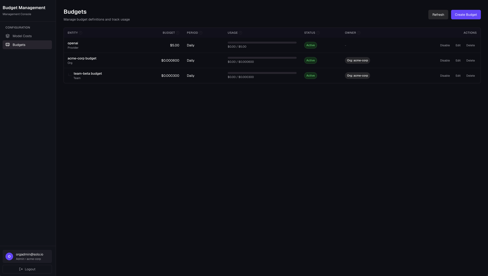
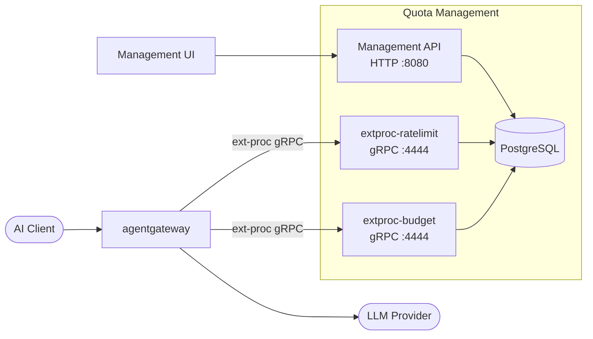
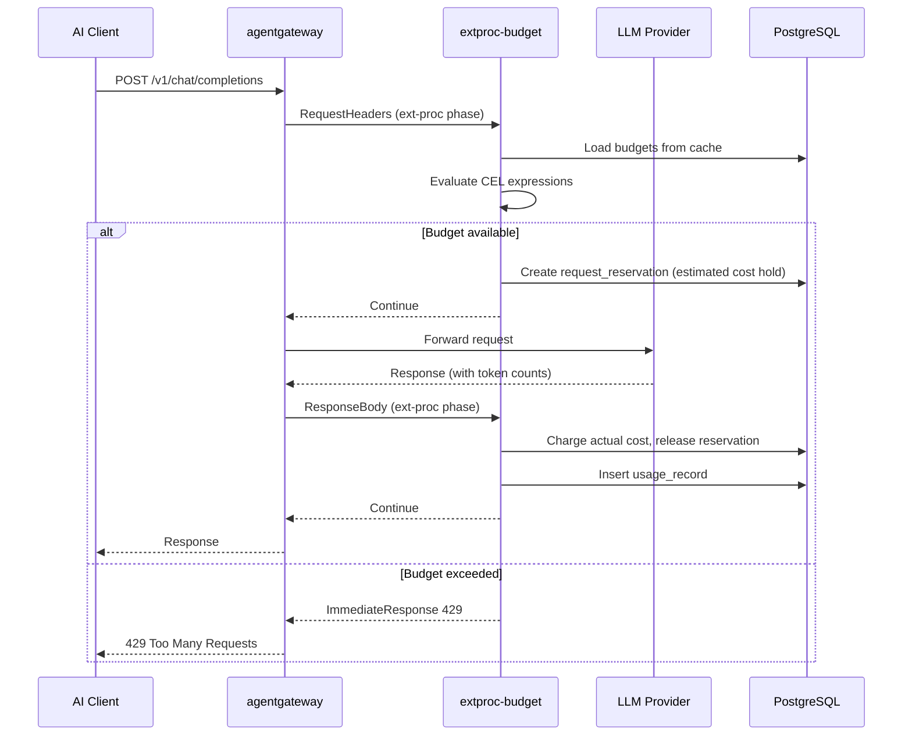

# Cost Control with Quota Management

This demo showcases Agent Gateway's cost control capabilities using a quota management service that enforces spending budgets and rate limits on LLM requests in real time.

## Overview



## Architecture



## Components

| Component | Description |
|-----------|-------------|
| **Agent Gateway** | Routes LLM requests and applies ext-proc for cost and rate limit enforcement |
| **extproc-budget** | ext-proc service that calculates costs and enforces spending budgets |
| **extproc-ratelimit** | ext-proc service that injects rate limit metadata for token/request quotas |
| **Management API** | REST API for configuring budgets, model costs, rate limits, and approvals |
| **PostgreSQL** | Stores budget definitions, usage records, model pricing, and audit logs |
| **Keycloak** | OIDC provider for UI authentication |
| **Management UI** | Web interface for managing budgets, rate limits, approvals, and viewing usage |

## Features Demonstrated

### Budget Enforcement

- **Hierarchical budgets** with parent-child relationships and configurable fallback behavior
- **CEL expression matching** to target budgets by org, team, model, JWT claims, or any request attribute
- **Dual-phase enforcement**: pre-flight reservation before upstream call, actual charge after response
- **Period resets**: automatic hourly, daily, weekly, monthly, or custom reset cycles
- **Soft disable**: org admins can disable budgets without deleting history
- **Approval workflow**: budgets require org-admin approval before becoming active

### Rate Limit Orchestration

- **Per-team, per-model allocations** with token and request limits
- **Model pattern matching** (e.g., `gpt-4*`, `claude-*`) for wildcard allocations
- **Burst allowance** configurable per allocation
- **Dynamic metadata injection** into Envoy's rate limiter via ext-proc headers
- **Approval workflow** matching the budget workflow

### Cost Tracking

- **Real-time cost calculation** using per-model input/output token pricing
- **35+ pre-loaded model costs** covering OpenAI, Anthropic, Google, Mistral, AWS
- **Usage history** per budget with token counts and USD charges
- **Prometheus metrics** for cost trends, utilization, denials, and latency

### Management UI

- **Budget dashboard**: create, edit, view usage, reset periods
- **Model cost catalog**: manage token pricing per model
- **Rate limit allocations**: configure per-team limits
- **Approval queue**: org admins approve or reject pending budgets and allocations
- **Audit log**: full compliance trail of all actions

### Access Control

- **JWT-based identity**: org ID, team ID, user ID extracted from token claims
- **Role-based filtering**: org admins see all org budgets; team members see only their own
- **Audit trail**: all create/update/approve/reject actions are logged with actor identity

## Configuration Files

| File | Purpose |
|------|---------|
| `config.yaml` | Gateway, HTTPRoutes, OIDC auth, and policies |
| `budget-management-deploy.yaml` | Budget management service deployment |
| `postgresql-deploy.yaml` | PostgreSQL with schema initialization |

## How Budget Enforcement Works



For hierarchical budgets, the child budget is checked first. If the child is exhausted and `allow_fallback=true`, the request falls through to the parent budget.

## Environment Variables

### Server Configuration

| Variable | Default | Description |
|----------|---------|-------------|
| `DATABASE_URL` | required | PostgreSQL connection string |
| `GRPC_PORT` | `4444` | ext-proc gRPC server port |
| `HTTP_PORT` | `8080` | Management API + UI port |
| `METRICS_PORT` | `9090` | Prometheus metrics port |
| `LOG_LEVEL` | `info` | Logging level (debug/info/warn/error) |

### Caching Configuration

| Variable | Default | Description |
|----------|---------|-------------|
| `BUDGET_CACHE_TTL` | `30s` | Budget definition cache duration |
| `MODEL_COST_CACHE_TTL` | `60s` | Model pricing cache duration |
| `RESERVATION_TTL` | `5m` | Pre-request budget hold duration |

### Cost Estimation

| Variable | Default | Description |
|----------|---------|-------------|
| `DEFAULT_ESTIMATION_MULTIPLIER` | `1.5` | Multiplier applied to pre-request cost estimate |
| `DEFAULT_ESTIMATED_INPUT_TOKENS` | `1000` | Default input tokens when estimation is needed |
| `DEFAULT_ESTIMATED_OUTPUT_TOKENS` | `1000` | Default output tokens when estimation is needed |

### Identity Headers

| Variable | Default | Description |
|----------|---------|-------------|
| `ORG_ID_HEADER` | `x-gw-org-id` | Header carrying the organization ID |
| `TEAM_ID_HEADER` | `x-gw-team-id` | Header carrying the team ID |
| `USER_ID_HEADER` | `x-user-id` | Header carrying the user ID |
| `MODEL_HEADER` | `x-gw-llm-model` | Header carrying the LLM model name |

## CEL Expression Examples

Budgets match requests using [Common Expression Language (CEL)](https://cel.dev) expressions:

```cel
# Match any request
true

# Match by LLM model
llm.model == "gpt-4o"

# Match models from a provider
llm.model.startsWith("claude-")

# Match by org from JWT
jwt.claims.org_id == "acme-corp"

# Match a specific team on a specific model
jwt.claims.team_id == "platform-eng" && llm.model == "gpt-4o-mini"

# Match by request header
request.headers["x-environment"] == "production"

# Match by org ID header (for UI budget definition)
# Headers are set by gateway JWT transformation before reaching ext-proc
"x-gw-org-id" in request.headers && request.headers["x-gw-org-id"] == "acme-corp"
```

## REST API

All management endpoints are served at `HTTP :8080`. The base path is `/api/v1`.

### Budgets

| Method | Path | Description |
|--------|------|-------------|
| `GET` | `/api/v1/budgets` | List budgets (filtered by caller's org/team) |
| `POST` | `/api/v1/budgets` | Create a new budget |
| `GET` | `/api/v1/budgets/{id}` | Get a single budget |
| `PUT` | `/api/v1/budgets/{id}` | Update a budget |
| `DELETE` | `/api/v1/budgets/{id}` | Soft-delete (disable) a budget |
| `POST` | `/api/v1/budgets/{id}/reset` | Manually reset current period usage |
| `GET` | `/api/v1/budgets/{id}/usage` | Get usage history for a budget |
| `POST` | `/api/v1/validate-cel` | Validate a CEL expression |

### Model Costs

| Method | Path | Description |
|--------|------|-------------|
| `GET` | `/api/v1/model-costs` | List all model costs |
| `POST` | `/api/v1/model-costs` | Add a new model |
| `GET` | `/api/v1/model-costs/{model_id}` | Get a single model's costs |
| `PUT` | `/api/v1/model-costs/{model_id}` | Update model pricing |
| `DELETE` | `/api/v1/model-costs/{model_id}` | Remove a model |
| `GET` | `/api/v1/model-costs/providers` | List distinct provider names |

### Rate Limit Allocations

| Method | Path | Description |
|--------|------|-------------|
| `GET` | `/api/v1/rate-limits` | List all allocations |
| `POST` | `/api/v1/rate-limits` | Create a new allocation |
| `GET` | `/api/v1/rate-limits/{id}` | Get a single allocation |
| `PUT` | `/api/v1/rate-limits/{id}` | Update an allocation |
| `DELETE` | `/api/v1/rate-limits/{id}` | Remove an allocation |

### Approvals

| Method | Path | Description |
|--------|------|-------------|
| `GET` | `/api/v1/approvals` | List pending approvals |
| `GET` | `/api/v1/approvals/count` | Count of pending approvals |
| `GET` | `/api/v1/approvals/history` | Full approval history |
| `POST` | `/api/v1/approvals/{budget_id}/approve` | Approve a budget |
| `POST` | `/api/v1/approvals/{budget_id}/reject` | Reject with reason |
| `POST` | `/api/v1/approvals/{budget_id}/resubmit` | Resubmit rejected budget |

### Audit Log

| Method | Path | Description |
|--------|------|-------------|
| `GET` | `/api/v1/audit` | Query audit log (supports filtering and pagination) |

## Prometheus Metrics

The quota management service exposes metrics on port `9090` at `/metrics`.

### Budget Enforcement Metrics

| Metric | Type | Labels | Description |
|--------|------|--------|-------------|
| `budget_management_requests_total` | Counter | `result` | Total requests processed (allowed/denied) |
| `budget_management_checks_total` | Counter | `entity_type`, `name`, `result` | Budget checks per entity |
| `budget_management_check_duration_seconds` | Histogram | `entity_type` | Duration of budget check operations |
| `budget_management_cost_charged_usd_total` | Counter | `entity`, `name`, `model` | Total cost charged in USD |
| `budget_management_tokens_total` | Counter | `entity`, `name`, `model`, `direction` | Tokens processed (input/output) |
| `budget_management_usage_usd` | Gauge | `entity`, `name`, `period` | Current budget usage in USD |
| `budget_management_remaining_usd` | Gauge | `entity`, `name`, `period` | Remaining budget in USD |
| `budget_management_utilization_pct` | Gauge | `entity`, `name`, `period` | Budget utilization percentage |
| `budget_management_requests_rate_limited_total` | Counter | `entity`, `name` | Requests denied due to budget exhaustion |
| `budget_management_fallbacks_total` | Counter | `child`, `parent` | Requests that fell back to parent budget |
| `budget_management_active_reservations` | Gauge | — | Number of active cost reservations |
| `budget_management_reservations_expired_total` | Counter | — | Total reservations expired |
| `budget_management_extproc_requests_total` | Counter | `phase`, `status` | ext-proc requests processed |
| `budget_management_extproc_duration_seconds` | Histogram | `phase` | ext-proc processing duration |

### Rate Limit Injection Metrics

| Metric | Type | Labels | Description |
|--------|------|--------|-------------|
| `quota_ratelimit_injections_total` | Counter | `result` (injected/skipped) | Rate limit metadata injections |
| `quota_ratelimit_lookup_duration_seconds` | Histogram | — | Allocation lookup duration |

### Accessing Metrics

```bash
# Port-forward the metrics port
kubectl port-forward -n agentgateway-system svc/quota-management 9090:9090

# Fetch metrics
curl http://localhost:9090/metrics
```

## Prerequisites

- Agent Gateway installed with enterprise features
- Keycloak running with `agw-dev` realm configured. Refer to [extras/keycloak/README.md](../extras/keycloak/README.md) for more details.
- `budget-management` client registered in Keycloak

## Deployment

The images have been published to the following repository. 

```bash
australia-southeast1-docker.pkg.dev/field-engineering-apac/public-repo/budget-management-ui@sha256:7a3935ee848b06e84d3c67cd54a280c08ac55a8adaec18e7d7d1e45a12c534be
```

and

```bash
australia-southeast1-docker.pkg.dev/field-engineering-apac/public-repo/budget-management-extproc@sha256:6f67b783d69577005d3f06d83e7a1233488fbbf1bfcb0bc1ea4ec547d9d07c84
```

```bash
# 1. Set OpenAI API key in config.yaml
# Replace: <set OPENAI_API_KEY> with your actual key

# 2. Apply PostgreSQL
kubectl apply -f config/postgresql-deploy.yaml

# 3. Apply budget management service
kubectl apply -f config/budget-management-deploy.yaml

# 4. Apply gateway configuration
kubectl apply -f config/config.yaml
```

## Accessing the UI

```bash
# Port-forward the gateway (HTTPS)
kubectl port-forward -n agentgateway-system svc/agentgateway 8443:443

# Add to /etc/hosts
echo "127.0.0.1 budget-management.agentgateway-system.svc.cluster.local" | sudo tee -a /etc/hosts

# Access UI
open https://budget-management.agentgateway-system.svc.cluster.local:8443
```

### Demo video


## Testing Budget Enforcement

```bash
# Port-forward the gateway (HTTP)
kubectl port-forward -n agentgateway-system svc/agentgateway 8080:8080

# Make LLM request
curl -X POST http://localhost:8080/openai/v1/chat/completions \
  -H "Content-Type: application/json" \
  -d '{
    "model": "gpt-4o-mini",
    "messages": [{"role": "user", "content": "Hello!"}]
  }'

# Response headers include cost info:
# X-Budget-Cost-USD: 0.000187
# X-Budget-Remaining-USD: 0.999813
```

## Budget Configuration via API

```bash
# Create a budget (via budget-management service)
curl -X POST http://localhost:8080/api/v1/budgets \
  -H "Content-Type: application/json" \
  -d '{
    "entity_type": "team",
    "name": "platform-eng-gpt4",
    "match_expression": "jwt.claims.team_id == '\''platform-eng'\'' && llm.model == '\''gpt-4o'\''",
    "budget_amount_usd": 100.00,
    "period": "monthly",
    "warning_threshold_pct": 80,
    "parent_id": null,
    "isolated": false,
    "allow_fallback": true
  }'
```

## Key Policies

### ext-proc Policy (Budget)
Intercepts all LLM requests and applies budget enforcement:
```yaml
traffic:
  extProc:
    backendRef:
      name: extproc-budget
      port: 4444
```

### ext-proc Policy (Rate Limit)
Injects rate limit metadata for Envoy's rate limiter:
```yaml
traffic:
  extProc:
    backendRef:
      name: extproc-ratelimit
      port: 4444
```

### OIDC Auth Policy
Protects the budget management UI:
```yaml
traffic:
  entExtAuth:
    authConfigRef:
      name: budget-management-auth
```
