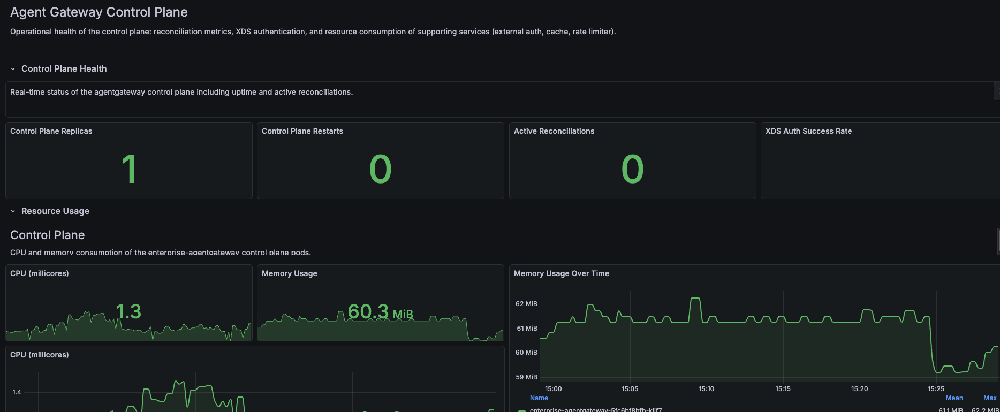

# Observability Stack

Refer to the [OpenTelemetry stack documentation](https://docs.solo.io/agentgateway/2.2.x/observability/otel-stack/) for more details.

## Grafana Dashboards

The `config/` folder contains pre-built Grafana dashboards for monitoring Agent Gateway. Import these JSON files into your Grafana instance.

### Available Dashboards

| Dashboard | File | Description |
|-----------|------|-------------|
| **Overview** | `agentgateway-overview.json` | High-level operational view: request rates, latency percentiles, error rates, token usage by model |
| **Performance** | `agentgateway-performance.json` | Resource metrics: CPU, memory, connections, Tokio runtime stats, network bandwidth |
| **Control Plane** | `agentgateway-control-plane.json` | Control plane health: replicas, restarts, XDS auth success rate, reconciliation status |
| **Cost Estimation** | `agentgateway-cost.json` | Token-based cost analysis: usage aggregation, cost rate, projected monthly costs by model |
| **Budget Enforcement** | `agentgateway-budget-enforcement.json` | Budget policy enforcement: denials, utilization, remaining budget, decisions by entity |

### Importing Dashboards

```bash
# Port-forward Grafana
kubectl port-forward -n monitoring svc/grafana 3000:3000

# Access Grafana at http://localhost:3000
# Go to Dashboards > Import > Upload JSON file
```

### Key Metrics

- **Request Rate** - Requests per second by status code
- **Latency** - P50/P95/P99 latency percentiles
- **Token Usage** - Input/output tokens by model
- **Cost** - Estimated cost based on token pricing
- **Budget** - Utilization vs limits, denial rates

