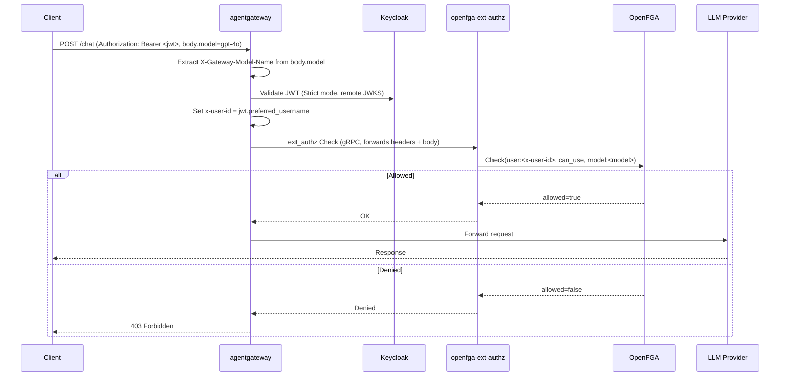

# Fine-Grained Authorization with OpenFGA

Demonstrates externalized, fine-grained authorization for LLM access using [OpenFGA](https://openfga.dev), a Zanzibar-style relationship-based access control (ReBAC) server. Every chat request must carry a valid Keycloak-issued JWT **and** pass an OpenFGA `Check` before it reaches the model provider — a user can be authenticated but still denied access to a specific model.

## Architecture



## Components

| Component | Description |
|-----------|--------------|
| **agentgateway** | Routes chat requests by body-derived model name and enforces JWT + ext_authz policies |
| **Keycloak** | OIDC provider; issues the JWT and exposes the `agw-dev` realm JWKS over TLS |
| **openfga-ext-authz** | gRPC `ext_authz` service — bridges agentgateway to the OpenFGA `Check` API ([source](https://github.com/day0ops/openfga-ext-authz)) |
| **OpenFGA** | ReBAC authorization server holding the store, model, and user/model relationship tuples |

## Features Demonstrated

- **Body-based model routing** — `X-Gateway-Model-Name` is derived from `json(request.body).model` and used to route `/chat` to the matching `EnterpriseAgentgatewayBackend`
- **Strict JWT authentication** — every request must present a valid token issued by the `agw-dev` Keycloak realm; there is no unauthenticated path
- **Claim-to-header propagation** — `jwt['preferred_username']` is copied to `x-user-id` before the ext_authz call
- **External authorization (ext_authz)** — `openfga-ext-authz` checks whether `user:<x-user-id>` has the `can_use` relation on `model:<model>` in OpenFGA, and allows or denies the request accordingly

## OpenFGA ext_authz Service

The `openfga-ext-authz` Deployment runs the gRPC service from [day0ops/openfga-ext-authz](https://github.com/day0ops/openfga-ext-authz). For every request it reads the user identity header, reads the `model` field already promoted onto `X-Gateway-Model-Name`, and asks OpenFGA whether the user has the configured relation on `<object type>:<model>`.

| Variable | Required | Default | Description |
|----------|----------|---------|--------------|
| `PORT` | no | `9001` | gRPC listen port |
| `OPENFGA_API_URL` | yes | — | Base URL of the OpenFGA server |
| `OPENFGA_STORE_ID` | yes | — | OpenFGA store ID to check against |
| `OPENFGA_MODEL_ID` | yes | — | OpenFGA authorization model ID to check against |
| `OPENFGA_RELATION` | no | `can_use` | Relation checked between the user and the object |
| `USER_HEADER` | no | `x-user-id` | Header carrying the caller's identity |
| `OBJECT_TYPE` | no | `model` | Object type prefixed onto the extracted model name (`model:gpt-4o`) |

## Setting Up OpenFGA

1. Create a store and write an authorization model with a `can_use` relation on a `model` type, e.g.:

    ```
    model
      schema 1.1

    type user

    type model
      relations
        define can_use: [user]
    ```

2. Write tuples granting users access to specific models, e.g. via the OpenFGA CLI:

    ```bash
    fga tuple write --store-id <STORE_ID> user:alice can_use model:gpt-4o
    fga tuple write --store-id <STORE_ID> user:alice can_use model:gpt-3.5-turbo
    # alice is not granted can_use on model:claude-sonnet-5 -> requests for that model are denied
    ```

3. Set `OPENFGA_STORE_ID` and `OPENFGA_MODEL_ID` in [`config/config.yaml`](./config/config.yaml) to the values from step 1.

Refer to the [OpenFGA documentation](https://openfga.dev/docs) for full `fga store create` / `fga model write` usage.

## Prerequisites

- Keycloak running with the `agw-dev` realm configured — see [extras/keycloak/README.md](../extras/keycloak/README.md)
- An OpenFGA server reachable at `http://openfga.openfga.svc.cluster.local:8080` (adjust `OPENFGA_API_URL` if different), with a store, model, and tuples as above
- Provider credentials for OpenAI and Anthropic

## Deployment

```bash
# 1. Set provider credentials in config/config.yaml
# Replace: <set OPENAI_API_KEY> and <set ANTHROPIC_API_KEY>

# 2. Set OPENFGA_STORE_ID and OPENFGA_MODEL_ID in config/config.yaml

# 3. Apply the configuration
kubectl apply -f config/config.yaml
```

## Testing

```bash
# Port-forward the gateway
kubectl port-forward -n agentgateway-system svc/agentgateway 8080:8080

# Allowed: alice has can_use on gpt-4o
curl -X POST http://localhost:8080/chat \
  -H "Authorization: Bearer <alice-jwt>" \
  -H "Content-Type: application/json" \
  -d '{"model": "gpt-4o", "messages": [{"role": "user", "content": "Hello!"}]}'

# Denied: alice has no can_use tuple on claude-sonnet-5 -> 403 Forbidden
curl -X POST http://localhost:8080/chat \
  -H "Authorization: Bearer <alice-jwt>" \
  -H "Content-Type: application/json" \
  -d '{"model": "claude-sonnet-5", "messages": [{"role": "user", "content": "Hello!"}]}'
```

## Key Policies

### JWT Authentication (Gateway-wide)

```yaml
jwtAuthentication:
  mode: Strict
  providers:
    - issuer: https://keycloak.demo.kasunt.apac.fe.solo.io/realms/agw-dev
      audiences: [account]
      jwks:
        remote:
          jwksPath: realms/agw-dev/protocol/openid-connect/certs
          cacheDuration: 5m
          backendRef:
            group: enterpriseagentgateway.solo.io
            kind: EnterpriseAgentgatewayBackend
            name: keycloak-jwks
```

### OpenFGA ext_authz (Route-scoped)

```yaml
extAuth:
  backendRef:
    name: openfga-ext-authz
    port: 9001
  grpc: {}
  forwardBody:
    maxSize: 8192
```

## Reference Links

- [openfga-ext-authz](https://github.com/day0ops/openfga-ext-authz) — the ext_authz gRPC service used in this scenario
- [OpenFGA documentation](https://openfga.dev/docs)
- [Agentgateway documentation](https://agentgateway.dev/docs/standalone/main/)
